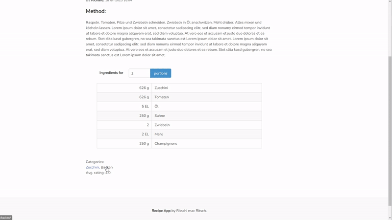
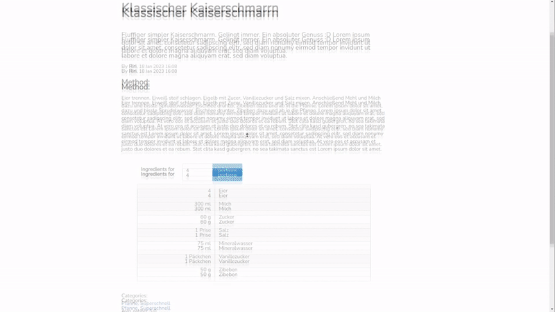

# recipe_manager_web_app
Basic recipe web app, built with the python web framework django. Work in progress.

### Implemented:
- [x] Frontpage with navbar and display of latest recipes (only brief description)
- [x] Detail Page
- [x] Categories Page
- [x] About Page
- [x] Add new recipe via admin page
- [x] Recipes can have categories
- [x] Search bar (Search for recipes containing a query word. Or search for recipes of the given category.)
- [x] Registration form
- [x] Login
- [x] Logout 
- [x] Portion calculation form

### To be implemented:
- [ ] Add new recipe (Only logged in users)
- [ ] Admin review page e.g. submitted recipes from users other than the admin must be approved before publication
- [ ] Improve frontend with Vue.js
- [ ] Rating (Users can rate recipes and select a "star" rating)
- [ ] Comment section below recipes on "Detail page"

### Current state:

#### (1) Detail view with calculation form

#### (2) Categories

#### (3) Sign up / Log in / Search bar

